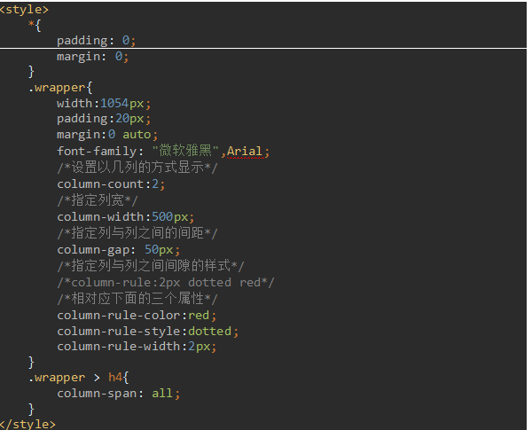

                                                            #### 							多列布局

- ##### 1、常用属性

  - ***colmun-count：属性设置列的具体个数***
  - ***column-width：属性空值列的具体个数***
  - ***column-gap：设置列宽;遵从取大取优原则，如果设置宽度值更到，则会铺满整个屏幕；如果设置宽度更小，使用默认计算的宽度***
  - ***colmun-rule：规定列之间的宽度、样式和颜色***
  - ***colmun-span：规定元素应横跨多少列 (n:指定跨n列  all:跨所有列 )***

- ##### 2、多列的用法

  

- ##### 3、列高度的平衡

  - ***如果设定列的最大高度,这个时候,文本内容会从第一列开始填充,然后第二列，第三列***

    #### 						伸缩布局

- ##### 布局的传统解决方案，基于盒模型,依赖position属性和float属性。而CSS3中做了很大的改进，即有了伸缩布局。

- ##### 1、重要属性

  - ***(1)、display；flex 如果一个容器设置了这个属性，那么这个盒子里的所有直接子元素都会自动的变成伸缩项***

  - ***(2)、justify-content：设置或检索弹性盒子元素在主轴方向上的对齐方式***

    - ***flex-start:让子元素从父容器的起始位置开始排列***
    - ***flex-end:让子元素从父元素的结束位置开始***
    - ***center：让子元素从父容器的中间开始排列***
    - ***space-between：左右对齐父容器的开始和结束 ，中间平均分配***
    - ***space-around：将多余的空间平均分配在每个子元素的两侧***

  - ***(3)、flex-flow：该属性是flex-direction属性和flex-wrap属性的合并，默认值是row nowrap，即主轴方向是水平方向,不换行***

    - ***flex-direction：***
      - ***row：主轴方向为默认值，即横向从左往右排列***
      - ***row-reverse：主轴方向为横向从右往左排列***
      - ***column：主轴方向为垂直方向，从上往下排列***
      - ***column-reverse：主轴方向为垂直轴，从下往上排列***
    - ***flex-wrap：***
      - ***nowrap：默认值，不换行***
      - ***wrap：换行***

  - ***(4)、flex属性：flex属性是flex-grow，flex-shrink和flex-basis的合并，默认值是0，1，auto***

    - ***flex-grow：设置当前元素应该占据剩余空前的比例值，默认值是0，即子元素默认是不会占据剩余空间部分***
    - ***flex-shrink：通过设置的值来计算收缩空间比例值，默认值是1***

  - ***(5)、align-items：设置子元素在侧轴方向上的对齐方式***

    - ***center：设置在侧轴方向上居中对齐***

    - ***flex-start：顶对齐***

    - ***flex-end：底对齐***

    - ***stretch：拉伸***

    - ***baseline：文本基线对齐***

      ​